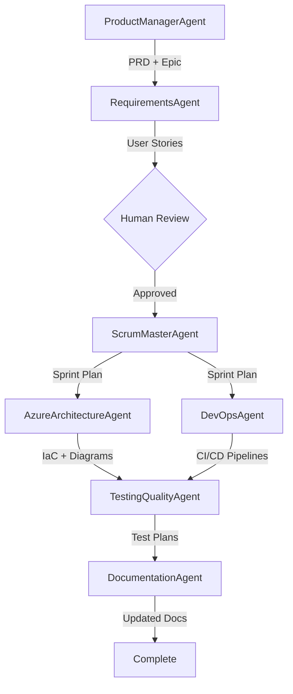

# OpenTickets Custom Agents System

**Version**: 1.1.0  
**Created**: 2026-01-08  
**Status**: Production Ready

Enterprise-grade 8-agent system for product management, requirements gathering, sprint planning, architecture design, DevOps automation, testing, documentation maintenance, and Aha! integration.

---

## 🎯 System Overview

This repository contains a collaborative multi-agent system that automates the software development lifecycle from product ideation to deployment and documentation. Built specifically for **OpenTickets** platform with integration to Azure DevOps Boards and GitHub Actions.

### Key Features
- ✅ **Automated Product Planning** - PRDs, roadmaps, and epics
- ✅ **Intelligent Story Creation** - With complexity analysis and story points
- ✅ **Sprint Management** - Capacity planning and daily updates
- ✅ **Azure Architecture** - IaC generation with Bicep
- ✅ **CI/CD Automation** - GitHub Actions to Azure Static Web Apps
- ✅ **Quality Assurance** - Playwright E2E tests
- ✅ **Living Documentation** - Auto-updated on code changes
- ✅ **Aha! Integration** - Sync epics, features, and requirements to Aha! platform

---

## 🤖 The 8 Agents

| # | Agent Name | Model | Purpose |
|---|------------|-------|---------|
| 1 | **ProductManagerAgent** | GPT-4o | Creates PRDs, roadmaps, and epics |
| 2 | **RequirementsGatheringAndStoryCreationAgent** | GPT-4o | Generates user stories with estimates |
| 3 | **ScrumMasterAgent** | GPT-4o-mini | Sprint planning and team coordination |
| 4 | **AzureArchitectureAgent** | GPT-4o | Cloud architecture and IaC |
| 5 | **DevOpsAgent** | GPT-4o | CI/CD pipelines and deployment |
| 6 | **TestingQualityAgent** | GPT-4o-mini | Test plans and E2E tests |
| 7 | **DocumentationMaintainerAgent** | GPT-4o-mini | Docs, APIs, ADRs, runbooks |
| 8 | **AhaIntegrationAgent** | GPT-4o-mini | Aha! API sync for epics, features, requirements |

---

## 🔄 Agent Workflow



###Workflow Steps
1. **ProductManagerAgent** analyzes repo → creates PRD → generates roadmap → auto-creates Epic
2. **RequirementsAgent** scans code → creates stories → estimates points → stages for review
3. **Human reviews** stories in `/ado-staging/stories/` → approves
4. **ScrumMasterAgent** assigns to sprint → balances capacity → triggers parallel agents
5. **AzureArchitectureAgent** + **DevOpsAgent** work in parallel → create IaC + CI/CD
6. **TestingQualityAgent** generates test plans → creates Playwright tests
7. **DocumentationAgent** updates all docs → workflow complete

---

## 📁 Project Structure

```
customAgents/
├── .github/
│   └── agents/                                    # 7 agent definitions
│       ├── ProductManagerAgent.agent.md
│       ├── RequirementsGatheringAndStoryCreationAgent.agent.md
│       ├── ScrumMasterAgent.agent.md
│       ├── AzureArchitectureAgent.agent.md
│       ├── DevOpsAgent.agent.md
│       ├── TestingQualityAgent.agent.md
│       └── DocumentationMaintainerAgent.agent.md
├── agent-logs/                                    # Summary logs for each agent
│   ├── ProductManagerAgent.reportlogs.md
│   └── ... (8 files total)
├── ado-staging/                                   # Azure DevOps work items (staged)
│   ├── epics/                                     # Epic JSON specs
│   ├── stories/                                   # User story JSON specs
│   ├── tasks/                                     # Task JSON specs
│   └── test-cases/                                # Test case JSON specs
├── aha-staging/                                   # Aha! work items (staged)
│   ├── epics/                                     # Aha! epic JSON specs
│   ├── features/                                  # Aha! feature JSON specs (user stories)
│   ├── requirements/                              # Aha! requirement JSON specs
│   └── releases/                                  # Aha! release JSON specs
├── architecture/                                  # Architecture artifacts
│   ├── diagrams/                                  # Mermaid diagrams
│   ├── iac/                                       # Bicep/IaC code
│   └── adrs/                                      # Architecture Decision Records
├── config/
│   ├── ado-config.json                            # Azure DevOps configuration (DUMMY KEYS)
│   └── aha-config.json                            # Aha! API configuration (DUMMY KEYS)
├── context-handoffs/                              # Cross-agent context sharing
│   ├── current-context.md                         # Active project context
│   └── archive/                                   # Historical context files
├── docs/                                          # Documentation
│   ├── api/                                       # API docs (OpenAPI)
│   ├── runbooks/                                  # Operational runbooks
│   └── troubleshooting/                           # Troubleshooting guides
├── pipelines/                                     # Generated CI/CD pipelines
├── products/                                      # Product artifacts
│   ├── prds/                                      # Product Requirements Documents
│   ├── roadmaps/                                  # Monthly roadmaps
│   └── sprints/                                   # Sprint plans
├── templates/                                     # Templates for all artifacts
│   ├── prd-template.md
│   ├── roadmap-template.md
│   ├── epic-template.md
│   ├── user-story-template.md
│   ├── sprint-plan-template.md
│   ├── architecture-doc-template.md
│   ├── test-plan-template.md
│   ├── adr-template.md
│   ├── aha-epic-template.json
│   ├── aha-feature-template.json
│   └── aha-templates-readme.md
└── README.md                                      # This file
```

---

## ⚙️ Configuration

### 1. Azure DevOps Setup

Edit `/config/ado-config.json`:

```json
{
  "azureDevOps": {
    "organization": "YOUR_ORG_NAME",              // Replace with your ADO org
    "project": "OpenTickets",                      // Replace with your project
    "authentication": {
      "personalAccessToken": "YOUR_PAT"            // Generate PAT in ADO
    }
  }
}
```

**To generate Azure DevOps PAT:**
1. Go to `https://dev.azure.com/YOUR_ORG/_usersSettings/tokens`
2. Click "New Token"
3. Scopes needed: Work Items (Read, Write), Test Management (Read, Write)
4. Copy token and update `ado-config.json`

### 2. Aha! Integration Setup

Edit `/config/aha-config.json`:

```json
{
  "aha": {
    "domain": "YOUR_SUBDOMAIN.aha.io",
    "apiUrl": "https://YOUR_SUBDOMAIN.aha.io/api/v1",
    "authentication": {
      "apiToken": "YOUR_AHA_API_TOKEN"
    },
    "product": {
      "productKey": "YOUR_PRODUCT_KEY",
      "productName": "OpenTickets"
    }
  },
  "integration": {
    "enabled": true,
    "syncWithAzureDevOps": true
  }
}
```

**To generate Aha! API Token:**
1. Log in to your Aha! account (https://YOUR_SUBDOMAIN.aha.io)
2. Go to Settings → Personal → Developer → API Keys
3. Click "Create API Key"
4. Copy token and update `aha-config.json`
5. Get your product key from the product settings page

### 3. GitHub Models Setup

Set environment variables:

```bash
# Windows PowerShell
$env:GITHUB_TOKEN="your_github_token"
$env:GITHUB_MODELS_ENDPOINT="https://models.inference.ai.azure.com"

# Linux/macOS
export GITHUB_TOKEN="your_github_token"
export GITHUB_MODELS_ENDPOINT="https://models.inference.ai.azure.com"
```

**To get GitHub token:**
1. Go to GitHub Settings → Developer settings → Personal access tokens
2. Generate new token (classic)
3. Scopes: `repo`, `workflow`, `read:org`

### 3. Azure Static Web Apps

Add to GitHub Secrets:
- `AZURE_STATIC_WEB_APPS_API_TOKEN`
- `AZURE_STATIC_WEB_APPS_API_TOKEN_STAGING`

Get tokens from Azure Portal → Static Web Apps → Deployment tokens

---

## 🚀 Getting Started - Complete Setup Guide

### Prerequisites Checklist

Before starting, ensure you have:

- [ ] **Windows 10/11** or macOS/Linux
- [ ] **Git** installed and configured
- [ ] **Node.js 20+** and npm ([Download](https://nodejs.org/))
- [ ] **VS Code** with GitHub Copilot extension installed
- [ ] **Azure DevOps** account ([Sign up free](https://dev.azure.com/))
- [ ] **GitHub** account with Models access
- [ ] **Azure subscription** (for deployment features)

---

## 📋 Step-by-Step Setup (15 minutes)

### Step 1: Clone the Repository

```powershell
# Navigate to your workspace
cd C:\Users\YourName\Development

# Clone the repo
git clone https://github.com/GurkhaStrategy/AgentJumpStart.git
cd AgentJumpStart\customAgents

# Verify structure
dir
```

---

### Step 2: Configure Azure DevOps Integration

#### 2.1 Create Azure DevOps Personal Access Token (PAT)

1. Go to **Azure DevOps**: https://dev.azure.com/[YOUR-ORG]
2. Click your profile icon (top right) → **Personal access tokens**
3. Click **+ New Token**
4. Configure token:
   - **Name**: `AgentJumpStart-Integration`
   - **Organization**: Select your organization
   - **Expiration**: 90 days (recommended)
   - **Scopes**: 
     - ✅ Work Items: **Read, Write, & Manage**
     - ✅ Test Management: **Read & Write**
5. Click **Create** and **COPY THE TOKEN** (you won't see it again!)

#### 2.2 Update Configuration File

```powershell
# Open config file
notepad config\ado-config.json
```

**Replace these values:**

```json
{
  "azureDevOps": {
    "organization": "YourOrgName",              // e.g., "contoso"
    "organizationUrl": "https://dev.azure.com/YourOrgName",
    "project": "YourProjectName",                // e.g., "OpenTickets"
    "authentication": {
      "personalAccessToken": "PASTE_YOUR_PAT_HERE"
    }
  },
  "teams": {
    "frontend": {
      "name": "Frontend Team",
      "areaPath": "YourProjectName\\Frontend",   // Update project name
      "members": [
        {"name": "Dev 1", "email": "dev1@company.com", "capacity": 6},
        {"name": "Dev 2", "email": "dev2@company.com", "capacity": 6},
        {"name": "Dev 3", "email": "dev3@company.com", "capacity": 6},
        {"name": "Dev 4", "email": "dev4@company.com", "capacity": 6}
      ]
    }
    // Update other teams similarly...
  },
  "github": {
    "organization": "YourGitHubOrg",
    "repository": "your-repo-name"
  },
  "azure": {
    "subscriptionId": "YOUR_AZURE_SUBSCRIPTION_ID",
    "tenantId": "YOUR_AZURE_TENANT_ID"
  }
}
```

**Save and close the file.**

---

### Step 3: Configure GitHub Token

#### 3.1 Create GitHub Personal Access Token

1. Go to **GitHub**: https://github.com/settings/tokens
2. Click **Generate new token (classic)**
3. Configure token:
   - **Note**: `AgentJumpStart-Models`
   - **Expiration**: 90 days
   - **Scopes**: 
     - ✅ `repo` (Full control)
     - ✅ `workflow` (Update workflows)
     - ✅ `read:org` (Read org data)
4. Click **Generate token** and **COPY IT**

#### 3.2 Set Environment Variable

**Windows PowerShell:**
```powershell
# Set for current session
$env:GITHUB_TOKEN="ghp_YOUR_TOKEN_HERE"

# Set permanently (recommended)
[System.Environment]::SetEnvironmentVariable('GITHUB_TOKEN', 'ghp_YOUR_TOKEN_HERE', 'User')

# Verify
$env:GITHUB_TOKEN
```

**macOS/Linux:**
```bash
# Add to ~/.bashrc or ~/.zshrc
export GITHUB_TOKEN="ghp_YOUR_TOKEN_HERE"

# Reload
source ~/.bashrc

# Verify
echo $GITHUB_TOKEN
```

---

### Step 4: Configure Aha! Integration (Optional)

#### 4.1 Get Aha! API Token

1. Log in to **Aha!**: https://YOUR_SUBDOMAIN.aha.io
2. Go to **Settings** (profile icon) → **Personal** → **Developer** → **API Keys**
3. Click **Create API Key**
4. **Name**: `AgentJumpStart-Integration`
5. **Scopes**: Full access (or customize as needed)
6. Click **Create** and **COPY THE TOKEN**

#### 4.2 Update Aha! Configuration File

```powershell
# Open config file
notepad config\aha-config.json
```

**Replace these values:**

```json
{
  "aha": {
    "domain": "yourcompany.aha.io",
    "apiUrl": "https://yourcompany.aha.io/api/v1",
    "authentication": {
      "apiToken": "PASTE_YOUR_AHA_API_TOKEN_HERE"
    },
    "product": {
      "productKey": "OPENTIC",                     // Get from product settings
      "productName": "OpenTickets"
    }
  },
  "integration": {
    "enabled": true,                                // Set false to disable Aha! sync
    "syncWithAzureDevOps": true,
    "autoCreateOnApproval": true
  }
}
```

**Save and close the file.**

#### 4.3 Verify Aha! Connection

```powershell
# Test Aha! API connectivity
$headers = @{Authorization = "Bearer YOUR_AHA_TOKEN"}
$response = Invoke-RestMethod -Uri "https://yourcompany.aha.io/api/v1/products" -Headers $headers
Write-Host "✅ Connected to Aha! Products: $($response.products.Count)"
```

---

### Step 5: Install Dependencies (if using Playwright tests)

```powershell
# Install Node packages
npm install

# Install Playwright browsers
npx playwright install

# Verify installation
npx playwright --version
```

---

### Step 6: Verify Setup

```powershell
# Check ADO configuration
cat config\ado-config.json

# Check Aha! configuration (if enabled)
cat config\aha-config.json

# Verify environment variable
Write-Host "GitHub Token: $($env:GITHUB_TOKEN.Substring(0,10))..."

# Test ADO connection (optional)
$headers = @{Authorization = "Bearer YOUR_PAT"}
$response = Invoke-RestMethod -Uri "https://dev.azure.com/YourOrg/YourProject/_apis/projects?api-version=7.0" -Headers $headers
Write-Host "✅ Connected to project: $($response.value[0].name)"
```

---

## 🎯 First Agent Execution

### Option 1: Using VS Code Copilot Chat (Recommended)

1. **Open VS Code** in the repository:
   ```powershell
   code .
   ```

2. **Open GitHub Copilot Chat** (Ctrl+Shift+I or Cmd+Shift+I)

3. **Invoke ProductManagerAgent**:
   ```
   @ProductManagerAgent 
   
   Create a PRD for a user authentication system with the following features:
   - Email/password login
   - Social login (Google, Microsoft)
   - Password reset functionality
   - Session management
   
   Target: Event organizers using OpenTickets platform
   Priority: P0 (Critical for Q1 2026)
   ```

4. **Wait for agent to complete** (~3-5 minutes)

5. **Review generated artifacts**:
   ```powershell
   # View PRD
   cat products\prds\user-authentication-prd.md
   
   # View Epic specification (ADO)
   cat ado-staging\epics\user-authentication-epic.json
   
   # View Epic specification (Aha! - if enabled)
   cat aha-staging\epics\user-authentication-epic.json
   
   # Check agent log
   cat agent-logs\ProductManagerAgent.reportlogs.md
   ```

6. **Optional: Invoke AhaIntegrationAgent** (if Aha! configured):
   ```
   @AhaIntegrationAgent Sync epics from /aha-staging/epics/ to Aha!
   ```

### Option 2: Manual Workflow Test

```powershell
# Create test PRD manually to test workflow
echo "Test PRD content" > products\prds\test-feature-prd.md

# Manually trigger context handoff
# (Agents will auto-detect and process)
```

---

## 📊 Review & Approval Workflow

### Step 1: ProductManager Creates PRD & Epic
- **Location**: `products/prds/[feature-name]-prd.md`
- **Action**: Review PRD for accuracy and completeness
- **Epic**: Auto-created in `ado-staging/epics/` (and `aha-staging/epics/` if enabled)
- **Aha! Sync**: Optionally invoke `@AhaIntegrationAgent` to create epic in Aha!

### Step 2: Requirements Agent Generates Stories
- **Location**: `ado-staging/stories/[epic-id]-story-*.json` (and `aha-staging/features/` if enabled)
- **Action**: Review user stories, acceptance criteria, and story point estimates
- **Aha! Sync**: Optionally invoke `@AhaIntegrationAgent` to create features in Aha!
- **Approval**: If approved, move to Step 3

### Step 3: Manual Approval for Sprint Planning
```powershell
# Review stories
dir ado-staging\stories\

# Open a story
cat ado-staging\stories\AUTH-001-story-001.json

# If approved, create approval flag
echo "APPROVED" > ado-staging\stories\.approved
```

### Step 4: Automated Workflow Continues
- **ScrumMaster** assigns to sprint
- **AzureArchitecture** & **DevOps** agents create infrastructure and pipelines
- **Testing** agent generates test plans
- **Documentation** agent updates docs

---

## 🔍 Monitoring Agent Activity

### View Agent Logs
```powershell
# View all agent activity
Get-ChildItem agent-logs\*.md | ForEach-Object { 
    Write-Host "`n=== $($_.Name) ===" -ForegroundColor Cyan
    Get-Content $_.FullName | Select-Object -Last 20
}

# View specific agent log
cat agent-logs\ProductManagerAgent.reportlogs.md

# Monitor in real-time (PowerShell)
Get-Content agent-logs\ProductManagerAgent.reportlogs.md -Wait -Tail 10
```

### Check Context Handoff Status
```powershell
cat context-handoffs\current-context.md
```

### View Generated Artifacts
```powershell
# PRDs and Roadmaps
dir products\prds\
dir products\roadmaps\

# Azure DevOps staged items
dir ado-staging\epics\
dir ado-staging\stories\
dir ado-staging\tasks\

# Aha! staged items (if enabled)
dir aha-staging\epics\
dir aha-staging\features\
dir aha-staging\requirements\

# Architecture artifacts
dir architecture\diagrams\
dir architecture\iac\

# Tests
dir tests\e2e\
```

---

## 🔧 Troubleshooting Common Issues

### Issue: "GitHub Token not found"
**Solution:**
```powershell
# Verify token is set
$env:GITHUB_TOKEN

# If empty, set it:
$env:GITHUB_TOKEN="ghp_YOUR_TOKEN_HERE"
```

### Issue: "Cannot connect to Azure DevOps"
**Solutions:**
1. Verify PAT token has correct scopes (Work Items: Read, Write, Manage)
2. Check organization and project names in `config/ado-config.json`
3. Test connection manually:
   ```powershell
   $pat = "YOUR_PAT"
   $encodedPat = [Convert]::ToBase64String([Text.Encoding]::ASCII.GetBytes(":$pat"))
   $headers = @{Authorization = "Basic $encodedPat"}
   Invoke-RestMethod -Uri "https://dev.azure.com/YourOrg/_apis/projects?api-version=7.0" -Headers $headers
   ```

### Issue: "Cannot connect to Aha!"
**Solutions:**
1. Verify Aha! API token in `config/aha-config.json`
2. Check your subdomain is correct (e.g., `yourcompany.aha.io`)
3. Test connection manually:
   ```powershell
   $headers = @{Authorization = "Bearer YOUR_AHA_TOKEN"}
   Invoke-RestMethod -Uri "https://yourcompany.aha.io/api/v1/products" -Headers $headers
   ```
4. Verify API token has correct permissions in Aha! settings
   ```

### Issue: "Agent not responding in VS Code"
**Solutions:**
1. Restart VS Code
2. Check GitHub Copilot is active (bottom right status bar)
3. Verify agent files exist in `.github/agents/`
4. Check VS Code Output panel (View → Output → GitHub Copilot)

### Issue: "Playwright tests failing"
**Solutions:**
```powershell
# Reinstall browsers
npx playwright install --with-deps

# Run tests in headed mode for debugging
npx playwright test --headed

# Check test configuration
cat playwright.config.ts
```

---

## 📞 Getting Help

### Documentation
- **Agent Definitions**: `.github/agents/*.agent.md`
- **Templates**: `templates/*.md`
- **Configuration**: `config/ado-config.json`

### Logs & Debugging
- **Agent Logs**: `agent-logs/*.reportlogs.md`
- **Git History**: `git log --grep="\[AgentName\]"`
- **Context Files**: `context-handoffs/current-context.md`

### Support Channels
- **GitHub Issues**: [Create issue](https://github.com/GurkhaStrategy/AgentJumpStart/issues)
- **Documentation**: Check `/docs/` folder
- **Email**: support@yourcompany.com

---

## ✅ Verification Checklist

Before handing off to client, verify:

- [ ] Repository cloned successfully
- [ ] `config/ado-config.json` updated with real credentials
- [ ] `GITHUB_TOKEN` environment variable set
- [ ] Azure DevOps connection tested
- [ ] First agent execution completed successfully
- [ ] Artifacts generated in correct folders
- [ ] Agent logs showing activity
- [ ] Client can access Azure DevOps project
- [ ] Client has VS Code with GitHub Copilot installed
- [ ] Client understands approval workflow
- [ ] Client knows how to view logs and artifacts

---

## 🎓 Training Resources

### For Product Managers
- Review: `ProductManagerAgent.agent.md`
- Learn: How to write effective PRD prompts
- Practice: Create 2-3 PRDs for familiar features

### For Developers
- Review: All agent definitions in `.github/agents/`
- Learn: Context handoff system (`context-handoffs/`)
- Practice: Customize templates in `templates/`

### For DevOps Engineers
- Review: `DevOpsAgent.agent.md`, `AzureArchitectureAgent.agent.md`
- Learn: How IaC and CI/CD pipelines are generated
- Practice: Review generated Bicep templates

---

## 🚦 Quick Start Checklist

Copy this checklist for each new client:

```
AgentJumpStart Setup Checklist
================================

[ ] 1. Clone repository
[ ] 2. Install Node.js 20+ and npm
[ ] 3. Install VS Code with GitHub Copilot
[ ] 4. Create Azure DevOps PAT token
[ ] 5. Update config/ado-config.json with credentials
[ ] 6. (Optional) Create Aha! API token
[ ] 7. (Optional) Update config/aha-config.json with credentials
[ ] 8. Create GitHub Personal Access Token
[ ] 9. Set GITHUB_TOKEN environment variable
[ ] 10. Run: npm install && npx playwright install
[ ] 11. Test first agent execution
[ ] 12. Review generated artifacts in ado-staging/ and aha-staging/
[ ] 13. Verify logs are being created
[ ] 14. Test approval workflow
[ ] 15. (Optional) Test Aha! integration with @AhaIntegrationAgent

Setup Complete! Ready for production use.
Contact: [Your support email/channel]
```

---

## 📊 Integration Platforms

### Azure DevOps Integration

#### Team Structure
- **Frontend Team**: 4 members, 240 points/sprint capacity
- **Backend Team**: 4 members, 240 points/sprint capacity
- **Infrastructure Team**: 4 members, 240 points/sprint capacity
- **Business Team**: 4 members, 240 points/sprint capacity

#### Sprint Configuration
- **Duration**: 2 weeks (10 working days)
- **Naming**: Sprint-YYYY-NN (e.g., Sprint-2026-01)
- **Capacity**: 80% utilization target (192 points per team)

#### Work Item Types
- **Epic**: High-level business objective
- **User Story**: Deliverable feature increment
- **Task**: Technical work (infrastructure, deployment)
- **Test Case**: E2E and performance tests

### Aha! Integration (Optional)

#### Work Item Mapping
- **ADO Epic** → **Aha! Epic**: Strategic initiatives
- **ADO User Story** → **Aha! Feature**: Deliverable capabilities
- **ADO Acceptance Criteria** → **Aha! Requirements**: Testable conditions
- **ADO Sprint** → **Aha! Release**: Time-boxed delivery

#### Aha! Configuration
- **Product Key**: Set in `config/aha-config.json`
- **Workflow States**: Customizable per work item type
- **Custom Fields**: Story points, team assignment, technical complexity
- **Tags**: Domain, tech stack, agent-created markers

#### Sync Modes
1. **Manual**: Invoke `@AhaIntegrationAgent` after work item creation
2. **Automatic**: Enable `autoCreateOnApproval` in config (creates on approval)
3. **Bidirectional**: Sync status changes from Aha! back to ADO

---

## 🔄 Git Workflow

### Commit Message Format
```
[AgentName] Action description

Examples:
[ProductManagerAgent] Created PRD for user authentication
[RequirementsAgent] Created 12 user stories for Epic AUTH-001
[AzureArchitectureAgent] Generated Bicep templates for auth infrastructure
```

### Branch Strategy
Agents create feature branches for:
- IaC code: `feature/architecture-[feature-name]`
- CI/CD pipelines: `feature/cicd-[feature-name]`

### Rollback
All changes committed to git - rollback via:
```powershell
git log --grep="\[AgentName\]"  # Find commit
git revert [commit-hash]         # Rollback
```

---

## 📝 Report Logging

Each agent maintains a report log at `/agent-logs/[AgentName].reportlogs.md`

### Log Format (Summary Only)
```markdown
## [TIMESTAMP] - Action: [Action Name]

**Files Modified:**
- /path/to/file.md (created/updated)

**Work Items Created:**
- Epic: [Title] (ID)
- Stories: [Count] ([Total Points])

**Next Agent:** [AgentName]

**Status:** ✅ Complete | ⏳ Awaiting Review | 🔴 Error
```

View logs:
```powershell
# View latest ProductManager actions
cat agent-logs\ProductManagerAgent.reportlogs.md | Select-Object -Last 50
```

---

## 🧪 Testing

### Playwright Integration
- Tests auto-generated by **TestingQualityAgent**
- Run on every PR via GitHub Actions
- Results uploaded to Azure DevOps Test Plans

### Run Tests Locally
```powershell
npm install
npx playwright install
npm run test:e2e
```

### Test Coverage Goals
- Critical paths: 100%
- Happy paths: 100%
- Edge cases: 90%
- Error scenarios: 90%

---

## 📚 Documentation Maintenance

**DocumentationAgent** auto-updates on code changes:
- README files
- API docs (OpenAPI/Swagger)
- Architecture Decision Records
- Runbooks and troubleshooting guides

Triggers:
- On commit to `main` or `develop`
- When architecture changes
- When APIs modified

---

## 🛡️ Security & Compliance

### Secrets Management
- Never commit tokens/keys to git
- Use environment variables
- Store secrets in Azure Key Vault
- Reference secrets in GitHub Actions

### Compliance
- All decisions logged in agent reports
- Full audit trail via git history
- Architecture decisions in ADRs
- Work items tracked in Azure DevOps

---

## 🔧 Troubleshooting

### Agent Not Responding
1. Check `GITHUB_TOKEN` environment variable
2. Verify GitHub Models endpoint reachable
3. Check agent logs for errors

### ADO Integration Failing
1. Verify PAT token has correct scopes
2. Check organization/project names in config
3. Test ADO API manually:
```powershell
$headers = @{Authorization = "Bearer $PAT"}
Invoke-RestMethod -Uri "https://dev.azure.com/ORG/PROJECT/_apis/wit/workitemtypes" -Headers $headers
```

### Aha! Integration Failing
1. Verify Aha! API token in `config/aha-config.json`
2. Check subdomain and product key are correct
3. Test Aha! API manually:
```powershell
$headers = @{Authorization = "Bearer $AHA_TOKEN"}
Invoke-RestMethod -Uri "https://yourcompany.aha.io/api/v1/products" -Headers $headers
```
4. Check AhaIntegrationAgent logs for detailed errors

### Work Items Not Syncing to Aha!
1. Verify `integration.enabled: true` in `aha-config.json`
2. Check staging files have `ahaId: null` (not yet synced)
3. Manually invoke: `@AhaIntegrationAgent Sync all pending work items`
4. Check rate limits (200 req/hour for Aha! API)

### Stories Not Generating
1. Ensure PRD exists in `/products/prds/`
2. Check context handoff file
3. Review RequirementsAgent logs

---

## 📈 Metrics & Monitoring

### Agent Performance
- Avg PRD creation time: ~5 minutes
- Avg stories per Epic: 10-20
- Avg story point estimate accuracy: ±15%

### Process Metrics
- Time to first story: < 10 minutes from PRD approval
- Sprint planning time: ~15 minutes (automated)
- Documentation lag: < 1 hour from code commit

---

## 🤝 Contributing

### Adding New Agents
1. Create agent definition in `.github/agents/`
2. Follow agent template structure
3. Add to workflow diagram
4. Update this README

### Modifying Templates
1. Edit templates in `/templates/`
2. Test with agents before committing
3. Document changes in template comments

---

## 📞 Support

### For Issues
1. Check `/docs/troubleshooting/`
2. Review agent logs in `/agent-logs/`
3. Search git history for similar issues
4. Create GitHub Issue with agent logs

### For Questions
- Documentation: See `/docs/`
- Architecture: See `/architecture/adrs/`
- Runbooks: See `/docs/runbooks/`

---

## 📜 License

MIT License - See LICENSE file

---

## 🗺️ Roadmap

### Q1 2026
- ✅ Initial 8-agent system (7 core + Aha! integration)
- ⏳ Azure Bicep validation
- ⏳ Auto-sync to Azure DevOps
- ⏳ Bidirectional Aha! status sync
- ⏳ Slack notifications

### Q2 2026
- ⏳ Agent performance dashboard
- ⏳ Custom agent templates per team
- ⏳ Multi-project support
- ⏳ Aha! webhook integration (real-time sync)

---

## 📊 Change Log

| Date | Version | Changes |
|------|---------|---------|
| 2026-01-08 | 1.1.0 | Added AhaIntegrationAgent for Aha! API sync |
| 2026-01-08 | 1.0.0 | Initial release with 7 agents |

---

**Built with ❤️ for OpenTickets Platform**
