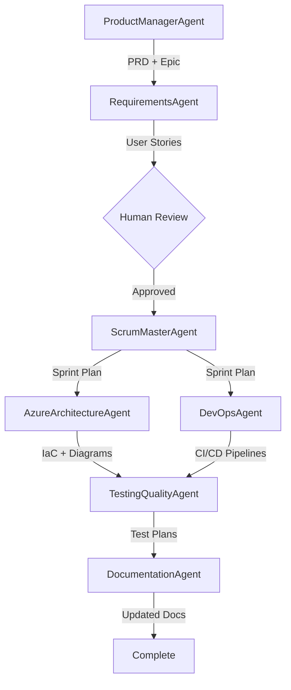

# OpenTickets Custom Agents System

**Version**: 1.0.0  
**Created**: 2026-01-08  
**Status**: Production Ready

Enterprise-grade 7-agent system for product management, requirements gathering, sprint planning, architecture design, DevOps automation, testing, and documentation maintenance.

---

## 🎯 System Overview

This repository contains a collaborative multi-agent system that automates the software development lifecycle from product ideation to deployment and documentation. Built specifically for **OpenTickets** platform with integration to Azure DevOps Boards and GitHub Actions.

### Key Features
- ✅ **Automated Product Planning** - PRDs, roadmaps, and epics
- ✅ **Intelligent Story Creation** - With complexity analysis and story points
- ✅ **Sprint Management** - Capacity planning and daily updates
- ✅ **Azure Architecture** - IaC generation with Bicep
- ✅ **CI/CD Automation** - GitHub Actions to Azure Static Web Apps
- ✅ **Quality Assurance** - Playwright E2E tests
- ✅ **Living Documentation** - Auto-updated on code changes

---

## 🤖 The 7 Agents

| # | Agent Name | Model | Purpose |
|---|------------|-------|---------|
| 1 | **ProductManagerAgent** | GPT-4o | Creates PRDs, roadmaps, and epics |
| 2 | **RequirementsGatheringAndStoryCreationAgent** | GPT-4o | Generates user stories with estimates |
| 3 | **ScrumMasterAgent** | GPT-4o-mini | Sprint planning and team coordination |
| 4 | **AzureArchitectureAgent** | GPT-4o | Cloud architecture and IaC |
| 5 | **DevOpsAgent** | GPT-4o | CI/CD pipelines and deployment |
| 6 | **TestingQualityAgent** | GPT-4o-mini | Test plans and E2E tests |
| 7 | **DocumentationMaintainerAgent** | GPT-4o-mini | Docs, APIs, ADRs, runbooks |

---

## 🔄 Agent Workflow



###Workflow Steps
1. **ProductManagerAgent** analyzes repo → creates PRD → generates roadmap → auto-creates Epic
2. **RequirementsAgent** scans code → creates stories → estimates points → stages for review
3. **Human reviews** stories in `/ado-staging/stories/` → approves
4. **ScrumMasterAgent** assigns to sprint → balances capacity → triggers parallel agents
5. **AzureArchitectureAgent** + **DevOpsAgent** work in parallel → create IaC + CI/CD
6. **TestingQualityAgent** generates test plans → creates Playwright tests
7. **DocumentationAgent** updates all docs → workflow complete

---

## 📁 Project Structure

```
customAgents/
├── .github/
│   └── agents/                                    # 7 agent definitions
│       ├── ProductManagerAgent.agent.md
│       ├── RequirementsGatheringAndStoryCreationAgent.agent.md
│       ├── ScrumMasterAgent.agent.md
│       ├── AzureArchitectureAgent.agent.md
│       ├── DevOpsAgent.agent.md
│       ├── TestingQualityAgent.agent.md
│       └── DocumentationMaintainerAgent.agent.md
├── agent-logs/                                    # Summary logs for each agent
│   ├── ProductManagerAgent.reportlogs.md
│   └── ... (7 files total)
├── ado-staging/                                   # Azure DevOps work items (staged)
│   ├── epics/                                     # Epic JSON specs
│   ├── stories/                                   # User story JSON specs
│   ├── tasks/                                     # Task JSON specs
│   └── test-cases/                                # Test case JSON specs
├── architecture/                                  # Architecture artifacts
│   ├── diagrams/                                  # Mermaid diagrams
│   ├── iac/                                       # Bicep/IaC code
│   └── adrs/                                      # Architecture Decision Records
├── config/
│   └── ado-config.json                            # Azure DevOps configuration (DUMMY KEYS)
├── context-handoffs/                              # Cross-agent context sharing
│   ├── current-context.md                         # Active project context
│   └── archive/                                   # Historical context files
├── docs/                                          # Documentation
│   ├── api/                                       # API docs (OpenAPI)
│   ├── runbooks/                                  # Operational runbooks
│   └── troubleshooting/                           # Troubleshooting guides
├── pipelines/                                     # Generated CI/CD pipelines
├── products/                                      # Product artifacts
│   ├── prds/                                      # Product Requirements Documents
│   ├── roadmaps/                                  # Monthly roadmaps
│   └── sprints/                                   # Sprint plans
├── templates/                                     # Templates for all artifacts
│   ├── prd-template.md
│   ├── roadmap-template.md
│   ├── epic-template.md
│   ├── user-story-template.md
│   ├── sprint-plan-template.md
│   ├── architecture-doc-template.md
│   ├── test-plan-template.md
│   └── adr-template.md
└── README.md                                      # This file
```

---

## ⚙️ Configuration

### 1. Azure DevOps Setup

Edit `/config/ado-config.json`:

```json
{
  "azureDevOps": {
    "organization": "YOUR_ORG_NAME",              // Replace with your ADO org
    "project": "OpenTickets",                      // Replace with your project
    "authentication": {
      "personalAccessToken": "YOUR_PAT"            // Generate PAT in ADO
    }
  }
}
```

**To generate Azure DevOps PAT:**
1. Go to `https://dev.azure.com/YOUR_ORG/_usersSettings/tokens`
2. Click "New Token"
3. Scopes needed: Work Items (Read, Write), Test Management (Read, Write)
4. Copy token and update `ado-config.json`

### 2. GitHub Models Setup

Set environment variables:

```bash
# Windows PowerShell
$env:GITHUB_TOKEN="your_github_token"
$env:GITHUB_MODELS_ENDPOINT="https://models.inference.ai.azure.com"

# Linux/macOS
export GITHUB_TOKEN="your_github_token"
export GITHUB_MODELS_ENDPOINT="https://models.inference.ai.azure.com"
```

**To get GitHub token:**
1. Go to GitHub Settings → Developer settings → Personal access tokens
2. Generate new token (classic)
3. Scopes: `repo`, `workflow`, `read:org`

### 3. Azure Static Web Apps

Add to GitHub Secrets:
- `AZURE_STATIC_WEB_APPS_API_TOKEN`
- `AZURE_STATIC_WEB_APPS_API_TOKEN_STAGING`

Get tokens from Azure Portal → Static Web Apps → Deployment tokens

---

## 🚀 Quick Start

### Prerequisites
- Node.js 20+
- Azure DevOps account
- GitHub account with Models access
- VS Code with GitHub Copilot

### Step 1: Configure
```powershell
# Edit ADO config
notepad config\ado-config.json

# Set GitHub token
$env:GITHUB_TOKEN="ghp_your_token_here"
```

### Step 2: Invoke ProductManagerAgent
Use in VS Code Copilot Chat:
```
@ProductManagerAgent Create a PRD for user authentication with social login support
```

### Step 3: Review & Approve
```powershell
# Review generated PRD
cat products\prds\user-authentication-prd.md

# Review generated Epic
cat ado-staging\epics\user-authentication-epic.json

# Check agent logs
cat agent-logs\ProductManagerAgent.reportlogs.md
```

### Step 4: Auto-Handoff
Agent automatically triggers **RequirementsAgent** → generates stories → waits for your review

### Step 5: Approve Stories
Review stories in `/ado-staging/stories/`, then approve to continue workflow

---

## 📊 Azure DevOps Integration

### Team Structure
- **Frontend Team**: 4 members, 240 points/sprint capacity
- **Backend Team**: 4 members, 240 points/sprint capacity
- **Infrastructure Team**: 4 members, 240 points/sprint capacity
- **Business Team**: 4 members, 240 points/sprint capacity

### Sprint Configuration
- **Duration**: 2 weeks (10 working days)
- **Naming**: Sprint-YYYY-NN (e.g., Sprint-2026-01)
- **Capacity**: 80% utilization target (192 points per team)

### Work Item Types
- **Epic**: High-level business objective
- **User Story**: Deliverable feature increment
- **Task**: Technical work (infrastructure, deployment)
- **Test Case**: E2E and performance tests

---

## 🔄 Git Workflow

### Commit Message Format
```
[AgentName] Action description

Examples:
[ProductManagerAgent] Created PRD for user authentication
[RequirementsAgent] Created 12 user stories for Epic AUTH-001
[AzureArchitectureAgent] Generated Bicep templates for auth infrastructure
```

### Branch Strategy
Agents create feature branches for:
- IaC code: `feature/architecture-[feature-name]`
- CI/CD pipelines: `feature/cicd-[feature-name]`

### Rollback
All changes committed to git - rollback via:
```powershell
git log --grep="\[AgentName\]"  # Find commit
git revert [commit-hash]         # Rollback
```

---

## 📝 Report Logging

Each agent maintains a report log at `/agent-logs/[AgentName].reportlogs.md`

### Log Format (Summary Only)
```markdown
## [TIMESTAMP] - Action: [Action Name]

**Files Modified:**
- /path/to/file.md (created/updated)

**Work Items Created:**
- Epic: [Title] (ID)
- Stories: [Count] ([Total Points])

**Next Agent:** [AgentName]

**Status:** ✅ Complete | ⏳ Awaiting Review | 🔴 Error
```

View logs:
```powershell
# View latest ProductManager actions
cat agent-logs\ProductManagerAgent.reportlogs.md | Select-Object -Last 50
```

---

## 🧪 Testing

### Playwright Integration
- Tests auto-generated by **TestingQualityAgent**
- Run on every PR via GitHub Actions
- Results uploaded to Azure DevOps Test Plans

### Run Tests Locally
```powershell
npm install
npx playwright install
npm run test:e2e
```

### Test Coverage Goals
- Critical paths: 100%
- Happy paths: 100%
- Edge cases: 90%
- Error scenarios: 90%

---

## 📚 Documentation Maintenance

**DocumentationAgent** auto-updates on code changes:
- README files
- API docs (OpenAPI/Swagger)
- Architecture Decision Records
- Runbooks and troubleshooting guides

Triggers:
- On commit to `main` or `develop`
- When architecture changes
- When APIs modified

---

## 🛡️ Security & Compliance

### Secrets Management
- Never commit tokens/keys to git
- Use environment variables
- Store secrets in Azure Key Vault
- Reference secrets in GitHub Actions

### Compliance
- All decisions logged in agent reports
- Full audit trail via git history
- Architecture decisions in ADRs
- Work items tracked in Azure DevOps

---

## 🔧 Troubleshooting

### Agent Not Responding
1. Check `GITHUB_TOKEN` environment variable
2. Verify GitHub Models endpoint reachable
3. Check agent logs for errors

### ADO Integration Failing
1. Verify PAT token has correct scopes
2. Check organization/project names in config
3. Test ADO API manually:
```powershell
$headers = @{Authorization = "Bearer $PAT"}
Invoke-RestMethod -Uri "https://dev.azure.com/ORG/PROJECT/_apis/wit/workitemtypes" -Headers $headers
```

### Stories Not Generating
1. Ensure PRD exists in `/products/prds/`
2. Check context handoff file
3. Review RequirementsAgent logs

---

## 📈 Metrics & Monitoring

### Agent Performance
- Avg PRD creation time: ~5 minutes
- Avg stories per Epic: 10-20
- Avg story point estimate accuracy: ±15%

### Process Metrics
- Time to first story: < 10 minutes from PRD approval
- Sprint planning time: ~15 minutes (automated)
- Documentation lag: < 1 hour from code commit

---

## 🤝 Contributing

### Adding New Agents
1. Create agent definition in `.github/agents/`
2. Follow agent template structure
3. Add to workflow diagram
4. Update this README

### Modifying Templates
1. Edit templates in `/templates/`
2. Test with agents before committing
3. Document changes in template comments

---

## 📞 Support

### For Issues
1. Check `/docs/troubleshooting/`
2. Review agent logs in `/agent-logs/`
3. Search git history for similar issues
4. Create GitHub Issue with agent logs

### For Questions
- Documentation: See `/docs/`
- Architecture: See `/architecture/adrs/`
- Runbooks: See `/docs/runbooks/`

---

## 📜 License

MIT License - See LICENSE file

---

## 🗺️ Roadmap

### Q1 2026
- ✅ Initial 7-agent system
- ⏳ Azure Bicep validation
- ⏳ Auto-sync to Azure DevOps
- ⏳ Slack notifications

### Q2 2026
- ⏳ Agent performance dashboard
- ⏳ Custom agent templates per team
- ⏳ Multi-project support

---

## 📊 Change Log

| Date | Version | Changes |
|------|---------|---------|
| 2026-01-08 | 1.0.0 | Initial release with 7 agents |

---

**Built with ❤️ for OpenTickets Platform**
